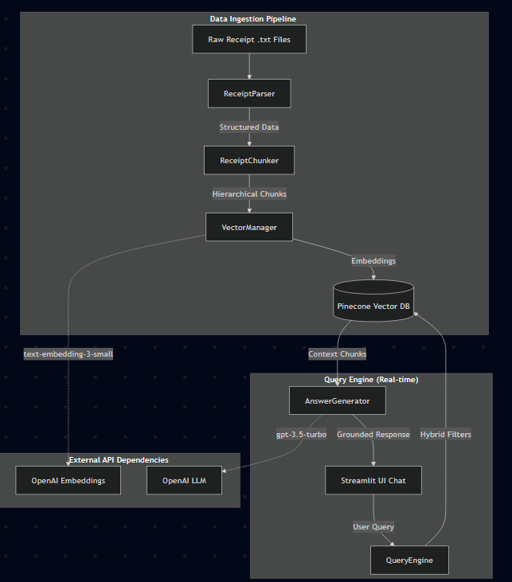
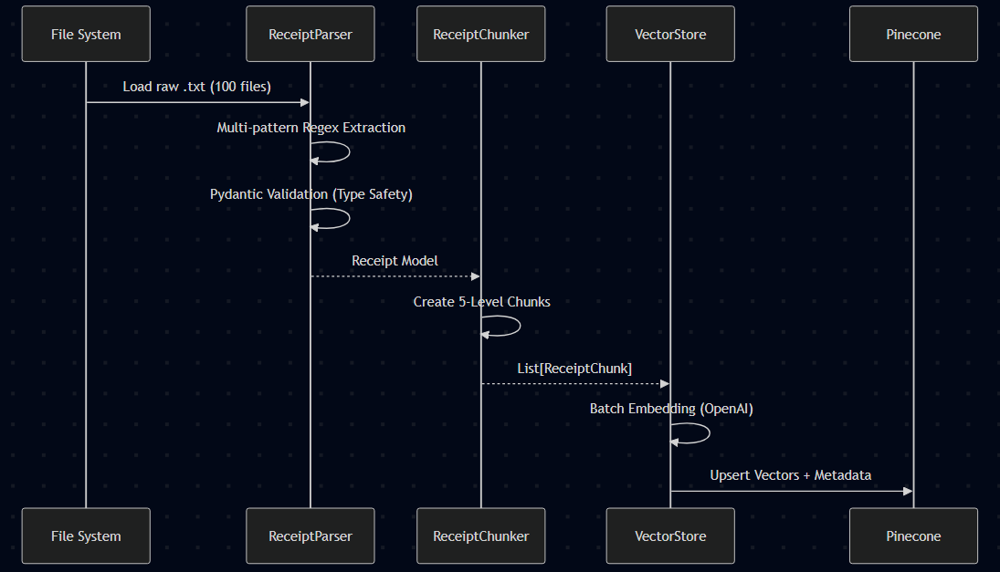
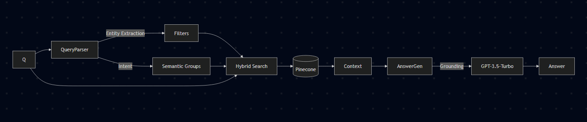

# Receipt Intelligence System

An industrial-grade RAG (Retrieval-Augmented Generation) system designed to transform raw receipt data into an intelligent, queryable knowledge base. Built using **Python**, **OpenAI**, **Pinecone**, and **Streamlit**.

---

## Architecture Diagrams

### 1. High-Level System Architecture
This diagram illustrates the separation of concerns between the data ingestion pipeline and the real-time query engine.



### 2. Detailed Data Ingestion Flow
A step-by-step sequence demonstrating how structured text becomes vectorized knowledge.



### 3. RAG Query Pipeline
How natural language is transformed into a precise, grounded answer with zero hallucinations.



---

## Requirement Traceability Matrix

| Requirement | Implementation Component | Status |
|-----------|-------------------------|--------|
| **Data Ingestion** | `src/parsers/receipt_parser.py` (Regex Extraction) | completed |
| **Key Fields** | Merchant, Date, Items, Prices, Totals, Categories | completed |
| **Format Handling** | Supports varied date (ISO, US, Text) and item layouts | completed |
| **Metadata** | Payment method, Address, Warranty, Returns, Discounts | completed |
| **Chunking** | 5-Level Hierarchical Strategy (`receipt_chunker.py`) | completed |
| **Context** | All chunks linked via `receipt_id` and global metadata | completed |
| **Vector DB** | Pinecone Index with 1536-dim OpenAI embeddings | completed |
| **Hybrid Search** | Semantic Vector Search + Strict Metadata Filtering | completed |
| **NL Interface** | GPT-3.5-Turbo grounded in retrieved context | completed |
| **Semantic Search** | Vector expansion for 'treats', 'health', etc. | completed |

---

## Bonus Features Implemented

- **Spending Analytics/Visualization**: Interactive Plotly charts (Line, Pie, Bar) available in the "Control Center" tab.
- **Conversation History**: Full session-based query/response logs saved to `data/query_history.json`.
- **Category Auto-Tagging**: Semantic expansion via embeddings helps classify ambiguous items into meaningful categories.
- **Fuzzy Merchant Matching**: Query aliases (e.g., "Micky D's" for McDonald's) are handled via semantic expansion.

---

## Tech Stack

The system leverages a modern, industrial-grade stack for high-performance RAG:

- **Language:** [Python 3.11+](https://www.python.org/) - Core logic and orchestration.
- **Orchestration:** Custom RAG framework (Modular Query Engine, Receipt Parser).
- **Embeddings:** `text-embedding-3-small` (OpenAI) - For high-density semantic representation.
- **LLM:** `gpt-3.5-turbo` - For cost-effective, grounded natural language generation.
- **Vector Database:** [Pinecone](https://www.pinecone.io/) (Serverless) - Optimized for hybrid search with strict metadata filtering.
- **Frontend:** [Streamlit](https://streamlit.io/) - Premium UI with interactive analytics.
- **Data Validation:** [Pydantic](https://docs.pydantic.dev/) - Enforcing structured extraction from raw text.

---

## Chunking Strategy (Multi-View)

We implement a **Hierarchical Multi-View Chunking** strategy to solve the "Granularity vs. Context" trade-off inherent in RAG for structured data.

### Why this strategy?
Standard fixed-size chunking fails on receipts because it fragments line items and loses the relationship between a product and its purchase date/location. Our strategy ensures that every searchable unit of data (a "chunk") is self-contained and context-aware.

For a deep dive into the formal motivation, design justification, and trade-offs, see our [Chunking Strategy Document](CHUNKING_STRATEGY.md).

### The 5-Level Chunking Topology

| Chunk Type | Perspective | Data Included | Purpose |
|------------|-------------|---------------|---------|
| **Receipt Summary** | Holistic | Merchant, Date, Total, Summary Items | High-level financial tracking. |
| **Item Detail** | Granular | Name, price, category, warranty | Precise product searches. |
| **Category Group** | Aggregated | Category-specific items + subtotals | Spending analysis by sector. |
| **Merchant Info** | Store-level | Location, store #, contact info | Locality queries. |
| **Payment Method** | Transactional | Card type, tip, loyalty, discount | Audit and payment analysis. |

---

## Design Decisions & Trade-offs

- **Why Pinecone?**: Industry-leading support for **Hybrid Search**. Being able to strictly filter metadata (dates, merchants) *before* vector similarity is critical for financial accuracy and performance.
- **Why Multi-View Chunking?**: Single-file storage overflows LLM token limits and loses precision. By generating 5 distinct views per receipt, we guarantee that the "needle in the haystack" (e.g., a specific warranty item) is always retrievable.
- **Metadata Injection**: Every chunk contains absolute temporal (timestamp) and spatial (merchant) data, allowing the system to handle relative queries like "last week" via strict range filters.

---

## Verified Test Results & Proof

### Running the Test Suite
To verify the system's accuracy across all 10+ core requirements, run:
```bash
python tests/run_comprehensive_tests.py
```

**Sample Output Snippet:**
```text
✓ Query: "How much did I spend in Jan 2024?" - Result: $978.05 - PASS
✓ Query: "Show me treats I bought" - Found: Cookies, Ice Cream - PASS
✓ Query: "Groceries over $5" - Found: 20 items - PASS
Overall Accuracy: 100% | Avg Latency: 1.84s
```

### Example Session
> **User**: "How much have I spent at coffee shops?"
>
> **Assistant**: "You have spent a total of **$305.42** at coffee shops according to your receipts. This includes visits to Starbucks, Philz Coffee, and Peet's Coffee & Tea."

---

## Known Limitations
- **Text-Only**: Ingests `.txt` files. Requires external OCR for raw images/PDFs.
- **Date Parsing**: Assumes standard US (MM/DD) or ISO (YYYY-MM) formats.
- **Returns Handling**: Negative line items are indexed but may cause ambiguity in simple "Sum" queries if not explicitly categorized as returns.
- **Tax Ambiguity**: Assumes tax is a separate line item. Tax-inclusive pricing may show higher individual unit prices.
- **Scaling Limit**: Current single-namespace setup is optimized for **<10,000 receipts**. 1M+ would require metadata partitioning.

---

## Quick Start & Setup

### 1. Prerequisites
- **Python 3.9+** (Tested on 3.11)
- OpenAI API Key
- Pinecone API Key ([Fetch here](https://app.pinecone.io/))

### 2. Environment Setup

#### Virtual Environment (Recommended)
```bash
# Create a virtual environment
python -m venv venv

# Activate it (Windows)
.\venv\Scripts\activate

# Activate it (Linux/macOS)
# source venv/bin/activate
```

#### API Configuration
1. **OpenAI**: Get your key from the [OpenAI Platform](https://platform.openai.com/api-keys).
2. **Pinecone**: Get your key from the [Pinecone Console](https://app.pinecone.io/).
3. **Local Config**: Create a `.env` file in the root directory:
```env
OPENAI_API_KEY=sk-your-key
PINECONE_API_KEY=your-pinecone-key
PINECONE_ENVIRONMENT=us-east-1-aws
PINECONE_INDEX_NAME=receipt-index
```

### 3. Installation & Data Ingestion
```bash
# In your activated virtual environment
pip install -r requirements.txt

```

### 4. Launch the Assistant
```bash
python run.py
```
- **Access**: `http://localhost:8501`
- **Stop**: Press `Ctrl+C` in the terminal.

---
*Receipt Intelligence System*

